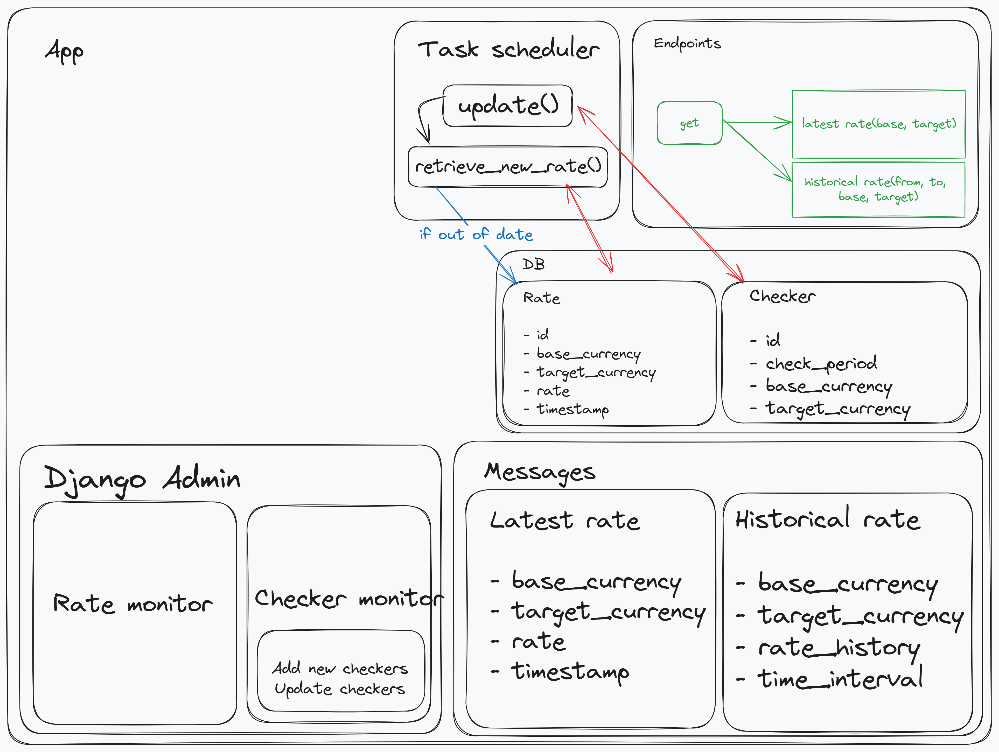

# Currency Api
### A simple tech challenge

This repo is part of a small tech challenge to create an api that
constantly checks currency exchange rates.

In the beginning it was planned only 2 endpoints, that were extended to 6:
 - 2 POST requisitions to deal with front-end forms
 - 2 GET requisitions to return json-like responses

If you want to test, please consider changing the variables inside configuration files.
Those are test only variables.

### Installation
There are two setup files. Simply run: 
 - ``chmod +x ./setup.sh``
 - ``chmod +x ./docker-setup.sh``

Then run:
 - ``sudo sh ./setup.sh``

When the script is finished, do the requested configurations.

Then:
 - ``sudo sh ./docker-setup.sh``